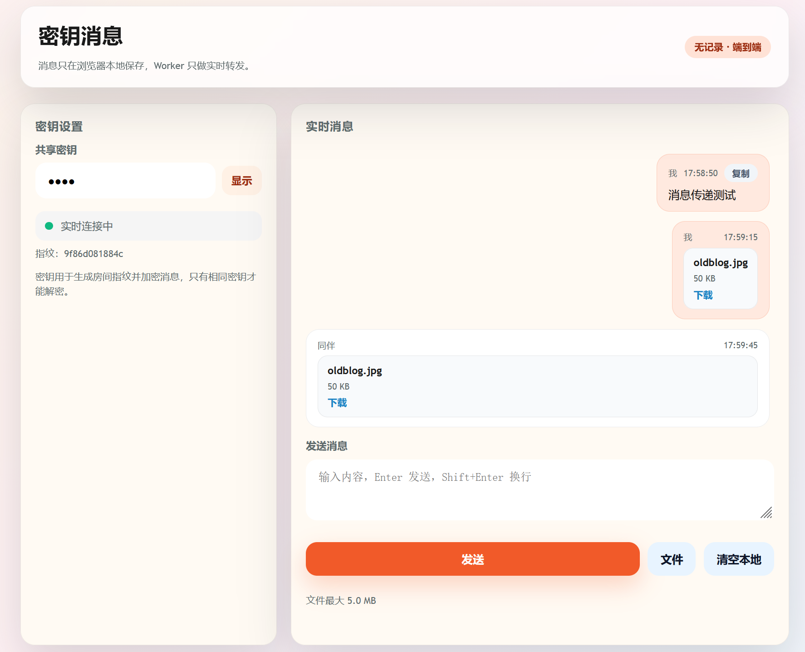

# Cloudflare Chat - 实时加密消息

**基于 Cloudflare Workers 的实时加密消息服务。**

## ✅ 特性

- 🌐 **跨网络**：只需浏览器，不受局域网限制，即可跨设备安全分享文本、小文件
- 🔐 **端到端加密**：AES-GCM 加密，服务端无法解密
- 💬 **实时消息**：WebSocket 即时转发
- 📱 **跨设备**：手机、电脑、平板，有浏览器就能用
- 📎 **文件分享**：支持 5MB 以内的图片和文件
- 🚫 **无数据存储**：消息只保存在浏览器本地，Worker 只做转发

## 🚀 部署到 Cloudflare

1. **Fork 本仓库**：需要 GitHub 账号，点击右上角 Fork 按钮
2. **注册 Cloudflare 账号**：访问 [dash.cloudflare.com](https://dash.cloudflare.com/sign-up)
3. **连接部署**：
   - 进入 Cloudflare Dashboard → **Workers & Pages**
   - 点击 **Create application** → **Pages** → **Connect to Git**
   - 选择你 Fork 的仓库，点击部署
4. **获取地址**：部署完成后得到 `https://cfchat-xxx.pages.dev`

> 💡 建议绑定自定义域名，避免 `*.pages.dev` 被防火墙拦截

## 📌 使用方式

1. 打开部署好的页面，输入共享密钥
2. 发送文本或粘贴/上传文件
3. 其他设备输入相同密钥即可实时收到消息

## ⚠️ 注意事项

- 密钥改变会进入新的房间
- 浏览器本地记录可随时清空
- 文件最大 5MB

## 📚 文档

- [使用手册](docs/usage.md)
- [技术方案](docs/architecture.md)

---

*Made with Cloudflare Workers*
